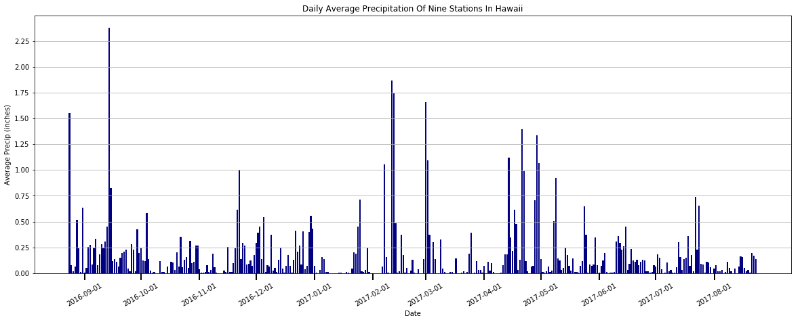
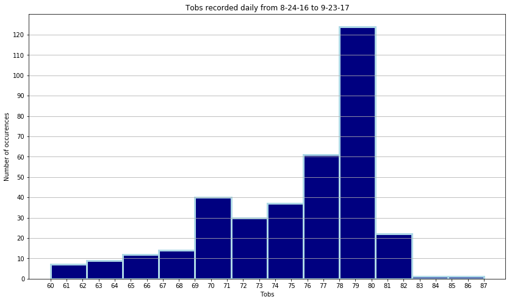
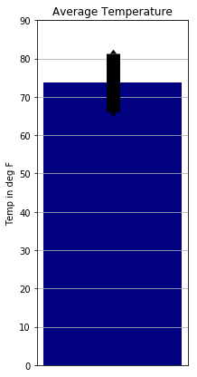

```python
import pandas as pd
import numpy as np
import os
import sqlalchemy
from sqlalchemy import create_engine, MetaData, inspect
from sqlalchemy.ext.declarative import declarative_base
from sqlalchemy import Column, Integer, String, Numeric, Text, Float
from sqlalchemy.orm import Session
from sqlalchemy.ext.automap import automap_base
import matplotlib.pyplot as plt
from flask import Flask, jsonify
import json
```


```python
engine = create_engine("sqlite:///hawaii.sqlite")
conn = engine.connect()
```


```python
Base= automap_base()
Base.prepare(engine,reflect=True)
Base.classes.keys()
inspector=inspect(engine)
inspector.get_table_names()
inspector.get_columns("measurements")
inspector.get_columns("stations")


```


    [{'autoincrement': 'auto',
      'default': None,
      'name': 'station',
      'nullable': False,
      'primary_key': 1,
      'type': TEXT()},
     {'autoincrement': 'auto',
      'default': None,
      'name': 'name',
      'nullable': True,
      'primary_key': 0,
      'type': TEXT()},
     {'autoincrement': 'auto',
      'default': None,
      'name': 'latitude',
      'nullable': True,
      'primary_key': 0,
      'type': FLOAT()},
     {'autoincrement': 'auto',
      'default': None,
      'name': 'longitude',
      'nullable': True,
      'primary_key': 0,
      'type': FLOAT()},
     {'autoincrement': 'auto',
      'default': None,
      'name': 'elevation',
      'nullable': True,
      'primary_key': 0,
      'type': FLOAT()}]


```python
class Measurements(Base):
    __tablename__ = "measurements"
    __table_args__ = {"extend_existing":True}
    mes_id = Column(Text,primary_key=True)
```


```python
class Stations(Base):
    __tablename__ = "stations"
    __table_args__ = {"extend_existing":True}
    station = Column(Text,primary_key=True)
```


```python
Base.prepare()
session=Session(engine)
session.query(Measurements).first().__dict__
```


    {'_sa_instance_state': <sqlalchemy.orm.state.InstanceState at 0x1a10fd79dd8>,
     'date': '2010-01-01',
     'mes_id': '0',
     'prcp': 0.08,
     'station': 'USC00519397',
     'tobs': 65}


```python
mes_list = []
output = session.query(Measurements).filter(Measurements.date>"2016-08-23")
for mes in output:
    mes_list.append([mes.prcp,mes.date])
mes_df = pd.DataFrame(mes_list)
mes_df.columns=(["precipitation","date"])
mes_df

```


<div>
<style scoped>
    .dataframe tbody tr th:only-of-type {
        vertical-align: middle;
    }

    .dataframe tbody tr th {
        vertical-align: top;
    }

    .dataframe thead th {
        text-align: right;
    }
</style>
<table border="1" class="dataframe">
  <thead>
    <tr style="text-align: right;">
      <th></th>
      <th>precipitation</th>
      <th>date</th>
    </tr>
  </thead>
  <tbody>
    <tr>
      <th>0</th>
      <td>0.08</td>
      <td>2016-08-24</td>
    </tr>
    <tr>
      <th>1</th>
      <td>0.08</td>
      <td>2016-08-25</td>
    </tr>
    <tr>
      <th>2</th>
      <td>0.00</td>
      <td>2016-08-26</td>
    </tr>
    <tr>
      <th>3</th>
      <td>0.00</td>
      <td>2016-08-27</td>
    </tr>
    <tr>
      <th>4</th>
      <td>0.01</td>
      <td>2016-08-28</td>
    </tr>
    <tr>
      <th>5</th>
      <td>0.00</td>
      <td>2016-08-29</td>
    </tr>
    <tr>
      <th>6</th>
      <td>0.00</td>
      <td>2016-08-30</td>
    </tr>
    <tr>
      <th>7</th>
      <td>0.13</td>
      <td>2016-08-31</td>
    </tr>
    <tr>
      <th>8</th>
      <td>0.00</td>
      <td>2016-09-01</td>
    </tr>
    <tr>
      <th>9</th>
      <td>0.00</td>
      <td>2016-09-02</td>
    </tr>
    <tr>
      <th>10</th>
      <td>0.00</td>
      <td>2016-09-03</td>
    </tr>
    <tr>
      <th>11</th>
      <td>0.03</td>
      <td>2016-09-04</td>
    </tr>
    <tr>
      <th>12</th>
      <td>0.05</td>
      <td>2016-09-07</td>
    </tr>
    <tr>
      <th>13</th>
      <td>0.00</td>
      <td>2016-09-08</td>
    </tr>
    <tr>
      <th>14</th>
      <td>0.03</td>
      <td>2016-09-09</td>
    </tr>
    <tr>
      <th>15</th>
      <td>0.00</td>
      <td>2016-09-10</td>
    </tr>
    <tr>
      <th>16</th>
      <td>0.05</td>
      <td>2016-09-11</td>
    </tr>
    <tr>
      <th>17</th>
      <td>0.00</td>
      <td>2016-09-12</td>
    </tr>
    <tr>
      <th>18</th>
      <td>0.02</td>
      <td>2016-09-13</td>
    </tr>
    <tr>
      <th>19</th>
      <td>1.32</td>
      <td>2016-09-14</td>
    </tr>
    <tr>
      <th>20</th>
      <td>0.42</td>
      <td>2016-09-15</td>
    </tr>
    <tr>
      <th>21</th>
      <td>0.06</td>
      <td>2016-09-16</td>
    </tr>
    <tr>
      <th>22</th>
      <td>0.05</td>
      <td>2016-09-17</td>
    </tr>
    <tr>
      <th>23</th>
      <td>0.00</td>
      <td>2016-09-18</td>
    </tr>
    <tr>
      <th>24</th>
      <td>0.00</td>
      <td>2016-09-19</td>
    </tr>
    <tr>
      <th>25</th>
      <td>0.00</td>
      <td>2016-09-20</td>
    </tr>
    <tr>
      <th>26</th>
      <td>0.00</td>
      <td>2016-09-21</td>
    </tr>
    <tr>
      <th>27</th>
      <td>0.02</td>
      <td>2016-09-22</td>
    </tr>
    <tr>
      <th>28</th>
      <td>0.00</td>
      <td>2016-09-23</td>
    </tr>
    <tr>
      <th>29</th>
      <td>0.00</td>
      <td>2016-09-24</td>
    </tr>
    <tr>
      <th>...</th>
      <td>...</td>
      <td>...</td>
    </tr>
    <tr>
      <th>1985</th>
      <td>0.39</td>
      <td>2017-07-17</td>
    </tr>
    <tr>
      <th>1986</th>
      <td>2.40</td>
      <td>2017-07-18</td>
    </tr>
    <tr>
      <th>1987</th>
      <td>0.27</td>
      <td>2017-07-19</td>
    </tr>
    <tr>
      <th>1988</th>
      <td>0.70</td>
      <td>2017-07-20</td>
    </tr>
    <tr>
      <th>1989</th>
      <td>0.10</td>
      <td>2017-07-21</td>
    </tr>
    <tr>
      <th>1990</th>
      <td>4.00</td>
      <td>2017-07-22</td>
    </tr>
    <tr>
      <th>1991</th>
      <td>0.80</td>
      <td>2017-07-23</td>
    </tr>
    <tr>
      <th>1992</th>
      <td>0.84</td>
      <td>2017-07-24</td>
    </tr>
    <tr>
      <th>1993</th>
      <td>0.30</td>
      <td>2017-07-25</td>
    </tr>
    <tr>
      <th>1994</th>
      <td>0.30</td>
      <td>2017-07-26</td>
    </tr>
    <tr>
      <th>1995</th>
      <td>0.00</td>
      <td>2017-07-27</td>
    </tr>
    <tr>
      <th>1996</th>
      <td>0.40</td>
      <td>2017-07-28</td>
    </tr>
    <tr>
      <th>1997</th>
      <td>0.30</td>
      <td>2017-07-29</td>
    </tr>
    <tr>
      <th>1998</th>
      <td>0.30</td>
      <td>2017-07-30</td>
    </tr>
    <tr>
      <th>1999</th>
      <td>0.00</td>
      <td>2017-07-31</td>
    </tr>
    <tr>
      <th>2000</th>
      <td>0.25</td>
      <td>2017-08-02</td>
    </tr>
    <tr>
      <th>2001</th>
      <td>0.06</td>
      <td>2017-08-03</td>
    </tr>
    <tr>
      <th>2002</th>
      <td>0.05</td>
      <td>2017-08-07</td>
    </tr>
    <tr>
      <th>2003</th>
      <td>0.34</td>
      <td>2017-08-08</td>
    </tr>
    <tr>
      <th>2004</th>
      <td>0.15</td>
      <td>2017-08-09</td>
    </tr>
    <tr>
      <th>2005</th>
      <td>0.07</td>
      <td>2017-08-10</td>
    </tr>
    <tr>
      <th>2006</th>
      <td>0.14</td>
      <td>2017-08-12</td>
    </tr>
    <tr>
      <th>2007</th>
      <td>0.22</td>
      <td>2017-08-14</td>
    </tr>
    <tr>
      <th>2008</th>
      <td>0.42</td>
      <td>2017-08-15</td>
    </tr>
    <tr>
      <th>2009</th>
      <td>0.42</td>
      <td>2017-08-16</td>
    </tr>
    <tr>
      <th>2010</th>
      <td>0.13</td>
      <td>2017-08-17</td>
    </tr>
    <tr>
      <th>2011</th>
      <td>0.09</td>
      <td>2017-08-19</td>
    </tr>
    <tr>
      <th>2012</th>
      <td>0.56</td>
      <td>2017-08-21</td>
    </tr>
    <tr>
      <th>2013</th>
      <td>0.50</td>
      <td>2017-08-22</td>
    </tr>
    <tr>
      <th>2014</th>
      <td>0.45</td>
      <td>2017-08-23</td>
    </tr>
  </tbody>
</table>
<p>2015 rows × 2 columns</p>
</div>


```python
avg_prcp = mes_df.groupby(mes_df["date"]).mean()
mes_df["precipitation"].describe()
```


    count    2015.000000
    mean        0.176462
    std         0.460288
    min         0.000000
    25%         0.000000
    50%         0.020000
    75%         0.130000
    max         6.700000
    Name: precipitation, dtype: float64


```python
plt.figure(figsize=(20,7))
plt.bar(avg_prcp.index,avg_prcp["precipitation"],color="navy")
plt.xticks(["2016-09-01","2016-10-01","2016-11-01","2016-12-01",
           "2017-01-01","2017-02-01","2017-03-01","2017-04-01",
           "2017-05-01","2017-06-01","2017-07-01","2017-08-01"],
          ["2016-09-01","2016-10-01","2016-11-01","2016-12-01",
           "2017-01-01","2017-02-01","2017-03-01","2017-04-01",
           "2017-05-01","2017-06-01","2017-07-01","2017-08-01"],rotation=30)
plt.yticks(np.arange(0,2.5,0.25))
plt.tick_params(axis="x", length=10, width=2)
plt.grid(axis="y")
plt.xlabel("Date")
plt.ylabel("Average Precip (inches)")
plt.title("Daily Average Precipitation Of Nine Stations In Hawaii")
plt.savefig("avgprcp.png")
plt.show()
```





```python
station_list = []
output = session.query(Stations)
for row in output:
    station_list.append([row.station,row.name])
sta_df = pd.DataFrame(station_list,columns=["station","name"])
sta_df
output_list = []
output = session.query(Measurements)
for row in output:
    output_list.append([row.station,row.tobs])
obs = pd.DataFrame(output_list,columns=["station","tobs"])
obs_df = obs.groupby("station").sum().reset_index()
obs_df
tobs_df = pd.merge(sta_df,obs_df,on="station")
tobs_df = tobs_df.sort_values("tobs",ascending=False)
tobs_df
```


<div>
<style scoped>
    .dataframe tbody tr th:only-of-type {
        vertical-align: middle;
    }

    .dataframe tbody tr th {
        vertical-align: top;
    }

    .dataframe thead th {
        text-align: right;
    }
</style>
<table border="1" class="dataframe">
  <thead>
    <tr style="text-align: right;">
      <th></th>
      <th>station</th>
      <th>name</th>
      <th>tobs</th>
    </tr>
  </thead>
  <tbody>
    <tr>
      <th>0</th>
      <td>USC00519397</td>
      <td>WAIKIKI 717.2, HI US</td>
      <td>200205</td>
    </tr>
    <tr>
      <th>6</th>
      <td>USC00519281</td>
      <td>WAIHEE 837.5, HI US</td>
      <td>198652</td>
    </tr>
    <tr>
      <th>1</th>
      <td>USC00513117</td>
      <td>KANEOHE 838.1, HI US</td>
      <td>195940</td>
    </tr>
    <tr>
      <th>5</th>
      <td>USC00519523</td>
      <td>WAIMANALO EXPERIMENTAL FARM, HI US</td>
      <td>191698</td>
    </tr>
    <tr>
      <th>8</th>
      <td>USC00516128</td>
      <td>MANOA LYON ARBO 785.2, HI US</td>
      <td>176029</td>
    </tr>
    <tr>
      <th>2</th>
      <td>USC00514830</td>
      <td>KUALOA RANCH HEADQUARTERS 886.9, HI US</td>
      <td>144913</td>
    </tr>
    <tr>
      <th>7</th>
      <td>USC00511918</td>
      <td>HONOLULU OBSERVATORY 702.2, HI US</td>
      <td>138191</td>
    </tr>
    <tr>
      <th>3</th>
      <td>USC00517948</td>
      <td>PEARL CITY, HI US</td>
      <td>50943</td>
    </tr>
    <tr>
      <th>4</th>
      <td>USC00518838</td>
      <td>UPPER WAHIAWA 874.3, HI US</td>
      <td>24855</td>
    </tr>
  </tbody>
</table>
</div>


```python
o_list = []
output = session.query(Measurements).filter(Measurements.date>"2016-08-23").filter(Measurements.station=="USC00519397")
for row in output:
    o_list.append([row.station,row.tobs])
tobs12m = pd.DataFrame(o_list,columns=["station","tobs"])
tobs12m
```


<div>
<style scoped>
    .dataframe tbody tr th:only-of-type {
        vertical-align: middle;
    }

    .dataframe tbody tr th {
        vertical-align: top;
    }

    .dataframe thead th {
        text-align: right;
    }
</style>
<table border="1" class="dataframe">
  <thead>
    <tr style="text-align: right;">
      <th></th>
      <th>station</th>
      <th>tobs</th>
    </tr>
  </thead>
  <tbody>
    <tr>
      <th>0</th>
      <td>USC00519397</td>
      <td>79</td>
    </tr>
    <tr>
      <th>1</th>
      <td>USC00519397</td>
      <td>80</td>
    </tr>
    <tr>
      <th>2</th>
      <td>USC00519397</td>
      <td>79</td>
    </tr>
    <tr>
      <th>3</th>
      <td>USC00519397</td>
      <td>77</td>
    </tr>
    <tr>
      <th>4</th>
      <td>USC00519397</td>
      <td>78</td>
    </tr>
    <tr>
      <th>5</th>
      <td>USC00519397</td>
      <td>78</td>
    </tr>
    <tr>
      <th>6</th>
      <td>USC00519397</td>
      <td>79</td>
    </tr>
    <tr>
      <th>7</th>
      <td>USC00519397</td>
      <td>80</td>
    </tr>
    <tr>
      <th>8</th>
      <td>USC00519397</td>
      <td>81</td>
    </tr>
    <tr>
      <th>9</th>
      <td>USC00519397</td>
      <td>80</td>
    </tr>
    <tr>
      <th>10</th>
      <td>USC00519397</td>
      <td>79</td>
    </tr>
    <tr>
      <th>11</th>
      <td>USC00519397</td>
      <td>75</td>
    </tr>
    <tr>
      <th>12</th>
      <td>USC00519397</td>
      <td>76</td>
    </tr>
    <tr>
      <th>13</th>
      <td>USC00519397</td>
      <td>80</td>
    </tr>
    <tr>
      <th>14</th>
      <td>USC00519397</td>
      <td>79</td>
    </tr>
    <tr>
      <th>15</th>
      <td>USC00519397</td>
      <td>78</td>
    </tr>
    <tr>
      <th>16</th>
      <td>USC00519397</td>
      <td>76</td>
    </tr>
    <tr>
      <th>17</th>
      <td>USC00519397</td>
      <td>78</td>
    </tr>
    <tr>
      <th>18</th>
      <td>USC00519397</td>
      <td>78</td>
    </tr>
    <tr>
      <th>19</th>
      <td>USC00519397</td>
      <td>75</td>
    </tr>
    <tr>
      <th>20</th>
      <td>USC00519397</td>
      <td>79</td>
    </tr>
    <tr>
      <th>21</th>
      <td>USC00519397</td>
      <td>80</td>
    </tr>
    <tr>
      <th>22</th>
      <td>USC00519397</td>
      <td>79</td>
    </tr>
    <tr>
      <th>23</th>
      <td>USC00519397</td>
      <td>81</td>
    </tr>
    <tr>
      <th>24</th>
      <td>USC00519397</td>
      <td>77</td>
    </tr>
    <tr>
      <th>25</th>
      <td>USC00519397</td>
      <td>77</td>
    </tr>
    <tr>
      <th>26</th>
      <td>USC00519397</td>
      <td>78</td>
    </tr>
    <tr>
      <th>27</th>
      <td>USC00519397</td>
      <td>76</td>
    </tr>
    <tr>
      <th>28</th>
      <td>USC00519397</td>
      <td>82</td>
    </tr>
    <tr>
      <th>29</th>
      <td>USC00519397</td>
      <td>81</td>
    </tr>
    <tr>
      <th>...</th>
      <td>...</td>
      <td>...</td>
    </tr>
    <tr>
      <th>328</th>
      <td>USC00519397</td>
      <td>81</td>
    </tr>
    <tr>
      <th>329</th>
      <td>USC00519397</td>
      <td>78</td>
    </tr>
    <tr>
      <th>330</th>
      <td>USC00519397</td>
      <td>80</td>
    </tr>
    <tr>
      <th>331</th>
      <td>USC00519397</td>
      <td>82</td>
    </tr>
    <tr>
      <th>332</th>
      <td>USC00519397</td>
      <td>79</td>
    </tr>
    <tr>
      <th>333</th>
      <td>USC00519397</td>
      <td>81</td>
    </tr>
    <tr>
      <th>334</th>
      <td>USC00519397</td>
      <td>81</td>
    </tr>
    <tr>
      <th>335</th>
      <td>USC00519397</td>
      <td>81</td>
    </tr>
    <tr>
      <th>336</th>
      <td>USC00519397</td>
      <td>80</td>
    </tr>
    <tr>
      <th>337</th>
      <td>USC00519397</td>
      <td>77</td>
    </tr>
    <tr>
      <th>338</th>
      <td>USC00519397</td>
      <td>73</td>
    </tr>
    <tr>
      <th>339</th>
      <td>USC00519397</td>
      <td>79</td>
    </tr>
    <tr>
      <th>340</th>
      <td>USC00519397</td>
      <td>80</td>
    </tr>
    <tr>
      <th>341</th>
      <td>USC00519397</td>
      <td>81</td>
    </tr>
    <tr>
      <th>342</th>
      <td>USC00519397</td>
      <td>80</td>
    </tr>
    <tr>
      <th>343</th>
      <td>USC00519397</td>
      <td>80</td>
    </tr>
    <tr>
      <th>344</th>
      <td>USC00519397</td>
      <td>80</td>
    </tr>
    <tr>
      <th>345</th>
      <td>USC00519397</td>
      <td>80</td>
    </tr>
    <tr>
      <th>346</th>
      <td>USC00519397</td>
      <td>81</td>
    </tr>
    <tr>
      <th>347</th>
      <td>USC00519397</td>
      <td>78</td>
    </tr>
    <tr>
      <th>348</th>
      <td>USC00519397</td>
      <td>80</td>
    </tr>
    <tr>
      <th>349</th>
      <td>USC00519397</td>
      <td>81</td>
    </tr>
    <tr>
      <th>350</th>
      <td>USC00519397</td>
      <td>79</td>
    </tr>
    <tr>
      <th>351</th>
      <td>USC00519397</td>
      <td>78</td>
    </tr>
    <tr>
      <th>352</th>
      <td>USC00519397</td>
      <td>80</td>
    </tr>
    <tr>
      <th>353</th>
      <td>USC00519397</td>
      <td>79</td>
    </tr>
    <tr>
      <th>354</th>
      <td>USC00519397</td>
      <td>81</td>
    </tr>
    <tr>
      <th>355</th>
      <td>USC00519397</td>
      <td>81</td>
    </tr>
    <tr>
      <th>356</th>
      <td>USC00519397</td>
      <td>82</td>
    </tr>
    <tr>
      <th>357</th>
      <td>USC00519397</td>
      <td>81</td>
    </tr>
  </tbody>
</table>
<p>358 rows × 2 columns</p>
</div>


```python
plt.figure(figsize=(14,8))
plt.hist(tobs12m["tobs"],bins=12,linewidth=3,edgecolor="lightblue",color="navy")
plt.xlabel("Tobs")
plt.ylabel("Number of occurences")
plt.title("Tobs recorded daily from 8-24-16 to 9-23-17")
plt.xticks(np.arange(60,88,1))
plt.yticks(np.arange(0,130,10))
plt.grid(axis="y")
plt.savefig("tobs.png")
plt.show()
```





```python
def calc_temps(startdate,enddate):
    t_list=[]
    output = session.query(Measurements).filter(Measurements.date.between(str(startdate),str(enddate)))
    for row in output:
        t_list.append(int(row.tobs))
        tmin = min(t_list)
        tavg = np.mean(t_list)
        tmax = max(t_list)
    return(tmin,tavg,tmax)
```


```python
tmin, tavg, tmax = calc_temps(input(prompt="Enter Start Date... "),input(prompt="Enter End Date... "))
#YYYY-MM-DD
```

    Enter Start Date... 2013-09-04
    Enter End Date... 2013-09-07
    


```python
plt.figure(figsize=(3,7))
plt.bar(0, tavg, .5,color="navy")
plt.errorbar(0, tavg, lolims=tmin, uplims=tmax, yerr=(tmax-tmin)/2,elinewidth=15,ecolor="black")
plt.yticks(np.arange(0,100,10))
plt.xticks(np.arange(0,0,1))
plt.grid(axis="y")
plt.title("Average Temperature")
plt.ylabel("Temp in deg F")
plt.savefig("avgtemp.png")
plt.show()
```




